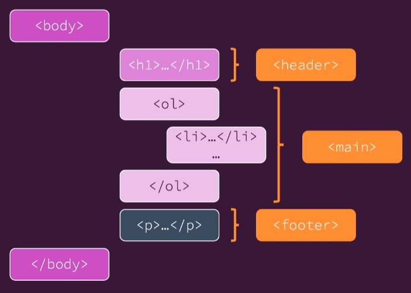

## The CSS Box Model

- content, padding, border, margin을 한 묶음으로 생각하기
- padding에 4가지가 들어가는데 시계방향으로 들어감

- 개발자 도구에서도 이렇게 확인할 수 있음
- css 코드에 없어도 기본적으로 적용되는 비율이 있음(padding 40) 이런건 직접 변경해야 됨(padding 0 이런 식으로)
### padding
- `padding: (1)`: 위아래 좌우 모든 곳에
- `padding: (1) (2)`: 1 - 상 하, 2 - 좌 우
- ex) `padding: 12px 48px;` 라면
    
    
- `padding: (1) (2) (3) (4)`: 1 위, 2 오, 3 아래, 4 왼
## Adding Structure to a Webpage

- 더 많은 정보는 https://developer.mozilla.org/en-US/docs/Learn/HTML/Introduction_to_HTML/Document_and_website_structure 확인

## Selectors & Combinations

- id는 한번만, class 는 여러 요소에 사용 가능
- selector: 특정한 곳에 적용
- combinators: 여러 selector 합친 것