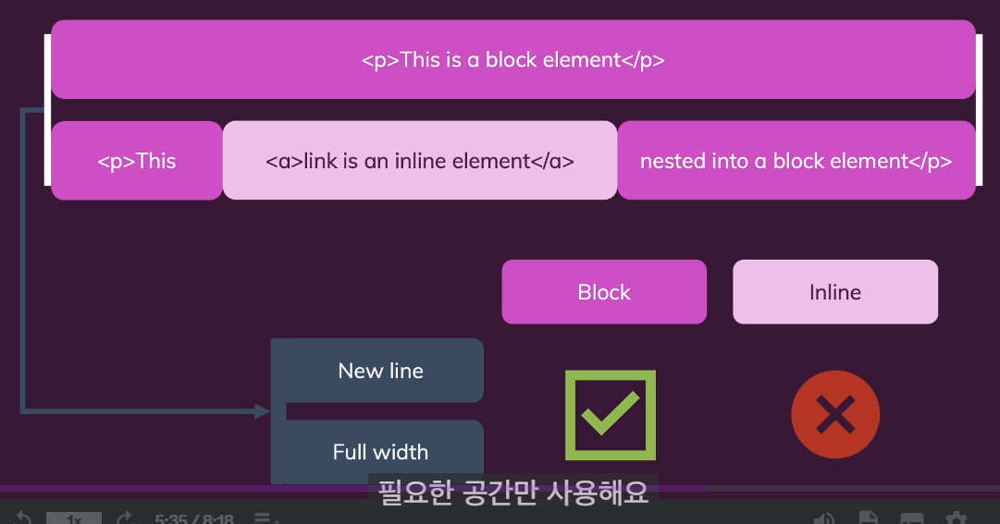
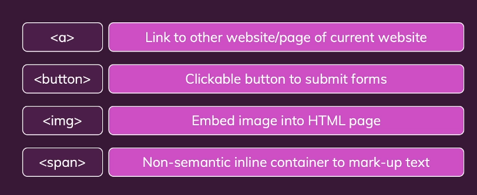

## 특정 요소 선택

1. id 사용
    
    ```html
    <p id="descripyion">These are my golas for the next days</p>
    ```
    
    ```css
    #descripyion {
        margin-bottom: 36px;
    }
    ```
    
2. 결합자
    
    ```html
    <body>
        **<header>**
          <h1>My Upcoming Challenges</h1>
          **<p>These are my golas for the next days</p>**
          <a href="index.html">View Today's Challenges</a>
        **</header>**
    ```
    
    ```css
    header p {
        margin-bottom: 36px;
    }
    ```
    
3. 클래스
    
    ```html
    <li **class = "highlight-goal"**>
      <h2>Wednesday, October 11th</h2>
      <p>Do the exercises on HTML & CSS</p>
    </li>
    ```
    
    ```css
    **.highlight-goal** {
        background-color: rgb(224, 110, 95);
    }
    ```
    

## Block (Level) Elements vs Inline Elements



## [Common Inline Elements](https://developer.mozilla.org/en-US/docs/Glossary/Inline-level_content)

