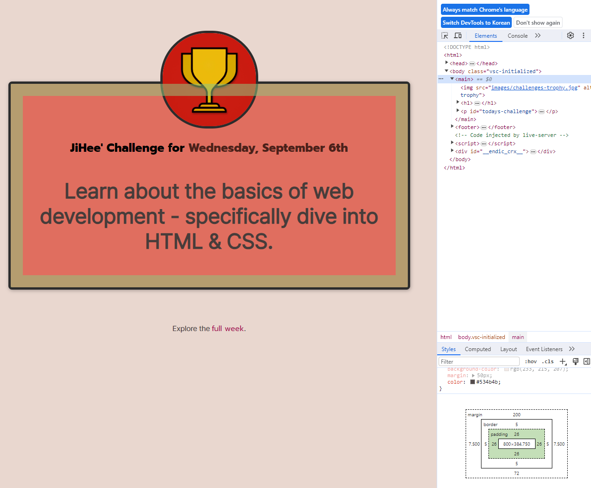

- inline elements는 위, 아래 margin, padding이 잘 적용되지 않음 → `display:inline-block;` 사용
    - inline, block, inline-block 등 이 있음
- semantic element: main, footer

## margin collapse

- block만 적용
    - inline 안되는 이유: 위 아래 margin이 적용되지 않기 때문
- 더 큰 여백 적용(8, 12가 있다면 12px 적용)
- block + inline ⇒ 여백 덧셈 됨(적용 X)
- inline-block: 적용 X

## Box-shadow

- `box-shadow: (x축) (y축) (테두리 흐림 정도) rgba(r, g, b, (투명도));`

## 해보자

- span highlighting
- 음수 여백? negative margin(top margin 중요)
    - /* padding: 요소와 텍스트 간의 거리 */
        
        
        
    - `margin-top: -50px` 이런 식으로 음수로 들어가면 padding 부분도 들어갈 수 있음
        - 이미지 올리는 식: 210/2(이미지 높이, 200+5+5(border)) + 29(padding: 24px; + border: 5px)  = 134

# **모든 CSS 선택자 리스트 [8일차]**

지금까지 우리는 이미 많은 주요 CSS 선택자에 대해 배웠습니다. 다음은 CSS에서 사용할 수 있는 모든 CSS 선택기의 목록/요약입니다(아직 보지 못한 일부 포함):

- **태그 유형 선택자**
    - CSS: `p { ... }`
    - 예를 들어 이 HTML 요소를 선택하면: `
Some text...
`
    - 이 선택자는 이 태그 유형의 모든 HTML 요소를 선택합니다.
- **아이디 선택자**
    - CSS: `#some-id { ... }`
    - 예를 들어 이 HTML 요소를 선택하면: `<h1 id="some-id">...</h1>`
    - 이 선택자는 이 ID가 있는 요소를 선택합니다(페이지당 한 번만 가능)
- **클래스 선택자**
    - CSS: `.some-class { ... }`
    - 예를 들어 이 HTML 요소를 선택하면: `<h1 class="some-class">...</h1>`
    - 이 선택자는 이 클래스가 있는 모든 HTML 요소를 선택합니다.
- **속성 선택기**(신규)
    - CSS: `[src] { ... }`
    - 예를 들어 이 HTML 요소를 선택하면: ``
    - 이 선택자는 이 HTML 속성이 있는 모든 요소를 선택합니다.
- **범용 선택기(신규)**
    - CSS: `* { ... }`
    - 예를 들어 이 HTML 요소를 선택하면: `
....
`
    - 이 선택자는 모든 HTML 요소를 선택합니다(상속을 통하지 않고 모든 HTML 요소를 개별적으로 대상으로 지정하는 것처럼 직접 가능).
- **그룹화 선택자/선택자 리스트**
    - CSS: `p`, `.some-class { ... }`
    - 예를 들어 이 HTML 요소를 선택하면: `
...
<h2 class="some-class">...</h2>`
    - 이 선택자는 해당 목록의 개별 선택자와 일치하는 모든 요소를 선택합니다.
- **결합 선택자**
    - CSS: `p.some-class { ... }`
    - 예를 들어 이 HTML 요소를 선택하면: `
...
`
    - 이 선택자는 두 조건을 모두 충족하는 모든 요소를 선택합니다(예: 이 예제에서는 "some-class" 클래스가 있는 "
" 요소).
- **의사 선택자**
    - CSS: `a:hover { ... }`
    - 예를 들어 이 HTML 요소를 선택하면: `<a>...</a>`(사용자가 해당 요소 위로 마우스를 가져갈 때)
    - 이 선택기는 이 "의사 상태"를 충족하는 모든 요소를 선택합니다(즉, 이 예에서 가리키고 있는 모든 링크).